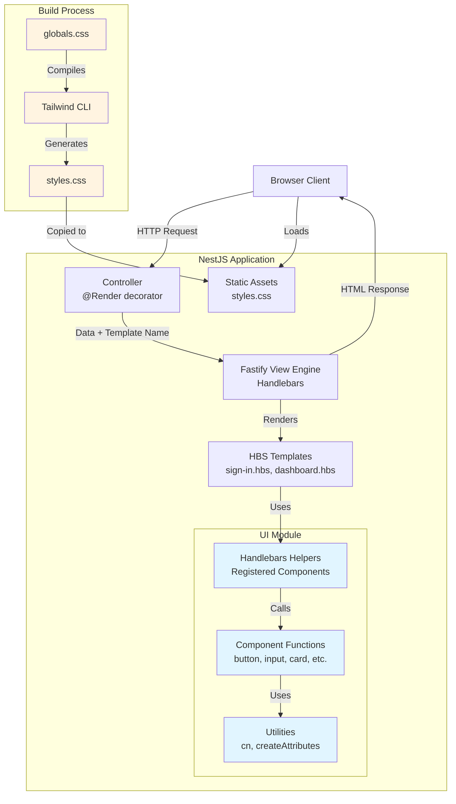

# Building a React-Like Component System with Server-Side Rendering in NestJS

## Introduction

Modern web development often presents a dilemma: should you build your application with client-side rendering (CSR) for rich interactivity, or server-side rendering (SSR) for better performance and SEO? While frameworks like React excel at creating component-based UIs on the client, certain features—particularly authentication flows, admin panels, and security-sensitive operations—benefit significantly from server-side rendering.

But here's the challenge: when you move to SSR, you often lose the elegant component model that makes React so productive. You're stuck writing repetitive template code, managing CSS classes manually, and duplicating UI logic between your backend templates and frontend components.

This article presents a solution: **a React-like component system built entirely on the backend** using NestJS, Handlebars, and Tailwind CSS. By the end, you'll have a server-rendered authentication flow and dashboard that feels as maintainable and composable as a React application—without shipping a single line of JavaScript to the client for rendering.

### What You'll Learn

- How to create reusable, type-safe UI components on the backend
- How to use Class Variance Authority (CVA) for component variants in server-side templates
- How to integrate Tailwind CSS v4 with NestJS and Fastify
- How to build an interactive dashboard with SSR
- When to choose SSR over CSR (and vice versa)

### Who This Is For

This guide is designed for developers who:

- **Love the React component model** but need SSR for specific use cases
- **Work with NestJS** and want to improve their template-based UI development
- **Need server-rendered authentication** or admin interfaces
- **Want to avoid duplicating UI logic** between backend and frontend

You should be comfortable with:

- Basic NestJS concepts (modules, controllers, decorators)
- TypeScript fundamentals
- High-level understanding of server-side rendering
- Basic HTML templating concepts

---

## Why Server-Side Rendering Still Matters

Before diving into implementation, let's understand when and why SSR is the right choice.

### Use Cases Where SSR Excels

1. **Authentication Flows**
   - Sign-in, sign-up, password reset pages
   - Session management happens server-side
   - Reduced attack surface (no client-side auth logic)
   - Faster time-to-interactive for critical flows

2. **Admin Panels and Dashboards**
   - Often behind authentication
   - Don't need heavy client-side interactivity
   - Benefit from server-side data access
   - Simpler deployment (no separate frontend build)

3. **SEO-Critical Pages**
   - Landing pages, marketing content
   - Blog posts, documentation
   - E-commerce product pages

4. **Progressive Enhancement**
   - Core functionality works without JavaScript
   - Enhanced with client-side features when available
   - Better accessibility and resilience

### The Traditional SSR Problem

The challenge with traditional SSR approaches is maintainability. Consider a typical scenario:

```handlebars
<!-- Traditional approach: repetitive, hard to maintain -->
<button class="px-4 py-2 bg-blue-600 text-white rounded hover:bg-blue-700">
  Submit
</button>

<button class="px-4 py-2 bg-gray-200 text-gray-900 rounded hover:bg-gray-300">
  Cancel
</button>

<button class="px-3 py-1 bg-red-600 text-white rounded text-sm hover:bg-red-700">
  Delete
</button>
```

Every button requires manually writing class names. When your design system changes, you need to find and update every instance. There's no reusability, and no single source of truth.

### Our Solution: Backend Components

With our approach, the same buttons become:

```handlebars
{{button variant='primary' size='lg' children='Submit' type='submit'}}
{{button variant='secondary' size='lg' children='Cancel'}}
{{button variant='destructive' size='sm' children='Delete'}}
```

This gives you:

- **Single source of truth** for component styles
- **Type-safe props** via TypeScript
- **Variant management** using CVA (just like shadcn/ui)
- **Easy refactoring** when design changes
- **Familiar API** if you've used React

---

## Technology Stack

Our implementation uses a carefully selected stack that balances performance, developer experience, and maintainability.

### Core Technologies

| Technology | Purpose | Version | Why We Chose It |
|------------|---------|---------|-----------------|
| **NestJS** | Backend framework | Latest | Industry-standard Node.js framework with excellent TypeScript support and modular architecture |
| **Fastify** | HTTP server | Latest | Faster than Express, excellent plugin ecosystem, first-class TypeScript support |
| **Handlebars** | Templating engine | Latest | Simple, logic-less templates with powerful helper system for custom components |
| **Tailwind CSS** | CSS framework | v4 (beta) | Utility-first approach, excellent for design systems, v4 offers simplified setup |

### Styling Utilities

| Package | Purpose | Why It's Essential |
|---------|---------|-------------------|
| **class-variance-authority** | Component variants | Type-safe variant management, same pattern as shadcn/ui and other modern component libraries |
| **clsx** | Conditional classes | Simple utility for constructing className strings conditionally |
| **tailwind-merge** | Class merging | Intelligently merges Tailwind classes, preventing conflicts when combining utilities |

### Integration Packages

| Package | Purpose | Notes |
|---------|---------|-------|
| **@nestjs/platform-fastify** | Fastify adapter for NestJS | Replaces default Express adapter |
| **@fastify/view** | Template engine support | Provides view rendering capabilities to Fastify |
| **@fastify/static** | Static file serving | Serves compiled CSS, images, and other assets |

> [!TIP]
> **Why Dev Dependencies?**: The styling utilities (`class-variance-authority`, `clsx`, `tailwind-merge`) are installed as dev dependencies because they're only needed at build time to generate CSS and component classes. They don't need to ship in the runtime bundle.

---

## Architecture Overview

Understanding the high-level architecture will help you see how all the pieces fit together.



### Request Flow

1. **Client Request**: Browser requests a page (e.g., `/auth/sign-in`)
2. **Controller**: NestJS controller handles the request, prepares data
3. **View Engine**: Fastify's view engine processes the Handlebars template
4. **Component Rendering**: Template uses registered helpers (components)
5. **HTML Generation**: Components return HTML strings with computed classes
6. **Response**: Complete HTML page sent to client
7. **Asset Loading**: Browser loads compiled CSS from static assets

### Key Design Decisions

**1. Components as Functions Returning Strings**

Unlike React components that return JSX, our components are TypeScript functions that return HTML strings:

```typescript
function createButton(props: ButtonProps): string {
  const classes = cn(buttonVariants({ variant, size }), className);
  return `<button class="${classes}" ${attributes}>${content}</button>`;
}
```

This keeps them:
- Framework-agnostic
- Easy to test
- Simple to port to React later

**2. Handlebars Helpers as Component Interface**

We register components as Handlebars helpers, providing a familiar API:

```typescript
Handlebars.registerHelper(
  'button',
  function (options: Handlebars.HelperOptions) {
    const props = (options?.hash as ButtonProps) || {};

    // If used as a block helper, use the block content as children
    if (options.fn) {
      props.children = options.fn(this);
    }

    const html = createButton(props);
    // Return SafeString to prevent HTML escaping
    return new Handlebars.SafeString(html);
  },
);
```

**3. CVA for Variant Management**

Using the same pattern as shadcn/ui and other modern component libraries:

```typescript
const buttonVariants = cva(baseStyles, {
  variants: {
    variant: { primary: '...', secondary: '...' },
    size: { sm: '...', md: '...', lg: '...' }
  }
});
```

---

## Step-by-Step Implementation

Let's build this system from the ground up.

### Step 1: Create the NestJS Project

Start by creating a fresh NestJS project using the official CLI:

```bash
# Install NestJS CLI globally
npm install -g @nestjs/cli

# Create new project
nest new react-ssr-project
```

When prompted, choose your preferred package manager (npm, yarn, or pnpm). For this guide, we'll use npm.

> [!TIP]
> If you already have a NestJS project, you can skip this step and integrate the following changes into your existing codebase.

### Step 2: Install Dependencies

Install the required packages for view rendering and styling:

```bash
# View engine and server dependencies
npm install @nestjs/platform-fastify @fastify/view @fastify/static handlebars

# Tailwind CSS v4 and styling utilities (dev dependencies)
npm install -D tailwindcss @tailwindcss/cli class-variance-authority clsx tailwind-merge
```

**What each package does:**

- `@nestjs/platform-fastify` – Fastify adapter for NestJS (replaces Express)
- `@fastify/view` – Template engine integration for Fastify
- `@fastify/static` – Serves static files (CSS, images, JavaScript)
- `handlebars` – Minimal, logic-less templating language
- `tailwindcss` – Core Tailwind CSS framework
- `@tailwindcss/cli` – Standalone CLI for compiling Tailwind
- `class-variance-authority` – Type-safe component variant management
- `clsx` – Utility for constructing className strings conditionally
- `tailwind-merge` – Intelligently merges Tailwind classes without conflicts

### Step 3: Configure Fastify with Handlebars

Replace the default Express adapter with Fastify and configure the view engine.

Update `src/main.ts`:

```typescript
import { NestFactory } from '@nestjs/core';
import {
  FastifyAdapter,
  NestFastifyApplication,
} from '@nestjs/platform-fastify';
import fastifyStatic from '@fastify/static';
import fastifyView from '@fastify/view';
import * as handlebars from 'handlebars';
import { join } from 'path';
import { AppModule } from './app.module';

async function bootstrap() {
  // Create NestJS app with Fastify adapter
  const app = await NestFactory.create<NestFastifyApplication>(
    AppModule,
    new FastifyAdapter(),
  );

  // Register static assets plugin
  await app.register(fastifyStatic, {
    root: join(__dirname, 'public'),
    prefix: '/', // Assets accessible at root (e.g., /styles.css)
  });

  // Register Handlebars as the view engine
  await app.register(fastifyView, {
    engine: { handlebars },
    root: join(__dirname, 'views'),
    layout: 'layout.hbs', // Default layout wrapper
    includeViewExtension: true, // Allows @Render('sign-in') instead of @Render('sign-in.hbs')
  });

  await app.listen(3000, '0.0.0.0');
  console.log(`Application is running on: http://localhost:3000`);
}

bootstrap();
```

> [!NOTE]
> If you don't have a `layout.hbs` file yet, you may want to comment out the `layout` option temporarily to avoid errors. We'll create it in Step 10.

**Configure Asset Copying**

NestJS doesn't copy arbitrary folders into the `dist` directory by default. Update `nest-cli.json` to include `public` and `views`:

```json
{
  "$schema": "https://json.schemastore.org/nest-cli",
  "collection": "@nestjs/schematics",
  "sourceRoot": "src",
  "compilerOptions": {
    "deleteOutDir": true,
    "assets": [
      {
        "include": "../public",
        "outDir": "dist/public",
        "watchAssets": true
      },
      {
        "include": "../views",
        "outDir": "dist/views",
        "watchAssets": true
      }
    ]
  }
}
```

This ensures that:
- `public/` → `dist/public` (CSS, images, etc.)
- `views/` → `dist/views` (Handlebars templates)

### Step 4: Configure Tailwind CSS v4

Tailwind v4 dramatically simplifies the setup process with its new CLI-based approach.

**Create the global CSS file**

Create `public/globals.css`:

```css
/* Import Tailwind's base styles */
@import 'tailwindcss';

/* Custom design tokens and utilities */
:root {
  --radius-base: 0.5rem;
}

/* Custom utility classes */
.hover-lift {
  @apply transition-transform duration-150 hover:-translate-y-0.5;
}

.hover-glow {
  @apply transition-shadow duration-150 hover:shadow-lg;
}

.glass {
  @apply bg-white/80 backdrop-blur-md;
}

.shadow-glow {
  box-shadow: 0 0 20px rgba(59, 130, 246, 0.3);
}

/* Add your custom styles here */
```

**Add build scripts**

Update `package.json` to include Tailwind compilation scripts:

```json
{
  "scripts": {
    "build:css": "npx @tailwindcss/cli -i ./public/globals.css -o ./public/styles.css",
    "watch:css": "npx @tailwindcss/cli -i ./public/globals.css -o ./public/styles.css --watch"
  }
}
```

**Usage:**

- `npm run build:css` – One-time build for production
- `npm run watch:css` – Watch mode for development (auto-recompiles on changes)

> [!TIP]
> **Development Workflow**: Run `npm run watch:css` in a separate terminal window while developing. This automatically rebuilds your CSS whenever you change templates or add new Tailwind classes.

### Step 5: Create the UI Module Structure

Following NestJS best practices, create a dedicated UI module to encapsulate all component-related code.

Your structure should look like this:

```
src/
├── ui/
│   ├── components/          # Reusable UI components
│   │   ├── button.ts
│   │   ├── input.ts
│   │   ├── card.ts
│   │   └── ... (more components)
│   ├── helpers/             # Handlebars helper registration
│   │   └── handlebars-helpers.ts
│   ├── utils/               # Shared utilities
│   │   └── utils.ts
│   └── ui.module.ts         # UI feature module
```

### Step 6: Create Utility Functions

Create `src/ui/utils/utils.ts`:

```typescript
import { clsx, type ClassValue } from 'clsx';
import { twMerge } from 'tailwind-merge';

/**
 * Combines class names and merges Tailwind classes intelligently
 * Prevents conflicts when combining utility classes
 */
export function cn(...inputs: ClassValue[]) {
  return twMerge(clsx(inputs));
}

/**
 * Converts an attributes object to an HTML attributes string
 * Handles boolean attributes correctly (e.g., disabled, required)
 */
export function createAttributesStringified(
  attributes: Record<string, string | number | boolean | undefined | null>,
): string {
  return Object.entries(attributes)
    .filter(([, value]) => value !== undefined && value !== null)
    .map(([key, value]) => {
      // Boolean attributes (disabled, required, etc.)
      if (typeof value === 'boolean') {
        return value ? key : '';
      }
      // Regular attributes
      return `${key}="${String(value)}"`;
    })
    .filter(Boolean)
    .join(' ');
}
```

**Why these utilities matter:**

- `cn()` – Safely merges Tailwind classes, resolving conflicts (e.g., `px-4 px-6` becomes `px-6`)
- `createAttributesStringified()` – Converts props to HTML attributes, handling edge cases like boolean attributes

### Step 7: Create the Button Component

Create `src/ui/components/button.ts`:

```typescript
import { cva, type VariantProps } from 'class-variance-authority';
import { cn, createAttributesStringified } from '../utils/utils';

/**
 * Button variants using CVA (Class Variance Authority)
 * Same pattern as shadcn/ui and other modern component libraries
 */
const buttonVariants = cva(
  // Your custom button styles here
);

/**
 * Button component props
 * Extends VariantProps to get type-safe variant and size props
 */
export interface ButtonProps extends VariantProps<typeof buttonVariants> {
  children?: string;
  className?: string;
  type?: 'button' | 'submit' | 'reset';
  disabled?: boolean;
  onclick?: string;
  [key: string]: unknown; // Allow additional HTML attributes
}

/**
 * Extracts HTML attributes from button props
 */
export function getButtonAttributes(
  props: ButtonProps,
): Record<string, string | boolean> {
  const { variant, size, className, children, onclick, ...attributes } = props;

  return {
    ...attributes,
    ...(onclick && { onclick }),
    ...(props.disabled && { disabled: true }),
    ...(props.type && { type: props.type }),
  };
}

/**
 * Creates a button HTML string with computed classes and attributes
 * This is the core component function that returns an HTML string
 */
export function createButton(props: ButtonProps): string {
  const { variant, size, className, children, ...rest } = props;
  
  // Compute final classes using CVA and cn utility
  const classes = cn(buttonVariants({ variant, size }), className);
  
  // Get HTML attributes
  const attributes = getButtonAttributes(rest);
  const attributesStringified = createAttributesStringified(attributes);

  const content = children ?? '';

  return `<button class="${classes}" ${attributesStringified}>${content}</button>`;
}

export { buttonVariants };
```

**Key concepts:**

1. **CVA for variants** – Define all button styles in one place with type safety
2. **Props interface** – TypeScript ensures correct usage
3. **String output** – Component returns HTML string (not JSX)
4. **Composability** – Can be extended with custom classes via `className` prop

> [!TIP]
> You can create additional components following this same pattern: `input`, `card`, `badge`, `avatar`, `kpi`, etc. Check the [GitHub repository](https://github.com/GrapeKode/ReactSSR) for complete examples.

### Step 8: Register Handlebars Helpers

Create `src/ui/helpers/handlebars-helpers.ts`:

```typescript
import * as Handlebars from 'handlebars';
import { createButton, type ButtonProps } from '../components/button';
import { createInput, type InputProps } from '../components/input';

/**
 * Registers all UI components as Handlebars helpers
 * Called during module initialization
 */
export function registerHandlebarsHelpers(): void {
  // Button helper with block support
  Handlebars.registerHelper(
    'button',
    function (options: Handlebars.HelperOptions) {
      const props = (options?.hash as ButtonProps) || {};

      // If used as a block helper, use the block content as children
      if (options.fn) {
        props.children = options.fn(this);
      }

      const html = createButton(props);
      // Return SafeString to prevent HTML escaping
      return new Handlebars.SafeString(html);
    },
  );

  // Input helper
  Handlebars.registerHelper(
    'input',
    function (options: Handlebars.HelperOptions) {
      const props = (options?.hash as InputProps) || {};
      const html = createInput(props);
      return new Handlebars.SafeString(html);
    },
  );

  // Conditional helpers for template logic
  Handlebars.registerHelper('eq', (a: unknown, b: unknown) => a === b);
  Handlebars.registerHelper('ne', (a: unknown, b: unknown) => a !== b);
  Handlebars.registerHelper('gt', (a: number, b: number) => a > b);
  Handlebars.registerHelper('lt', (a: number, b: number) => a < b);
  Handlebars.registerHelper('gte', (a: number, b: number) => a >= b);
  Handlebars.registerHelper('lte', (a: number, b: number) => a <= b);
  Handlebars.registerHelper('and', (a: unknown, b: unknown) => a && b);
  Handlebars.registerHelper('or', (a: unknown, b: unknown) => a || b);
  Handlebars.registerHelper('not', (a: unknown) => !a);

  // String helper for avatars, initials, etc.
  Handlebars.registerHelper(
    'substring',
    (str: string, start: number, end: number) => {
      if (!str) return '';
      return str.substring(start, end).toUpperCase();
    },
  );
}
```

**Important concepts:**

- `Handlebars.SafeString` – Prevents HTML escaping (required for rendering HTML)
- Block support (`options.fn`) – Allows nested content like `{{#button}}...{{/button}}`
- Conditional helpers – Enable logic in templates without JavaScript

### Step 9: Create the UI Module

Create `src/ui/ui.module.ts`:

```typescript
import { Module, OnModuleInit } from '@nestjs/common';
import { registerHandlebarsHelpers } from './helpers/handlebars-helpers';

@Module({})
export class UiModule implements OnModuleInit {
  /**
   * Register Handlebars helpers when the module initializes
   * This runs once when the application starts
   */
  onModuleInit(): void {
    registerHandlebarsHelpers();
  }
}
```

**Import the UI module in your app module:**

Update `src/app.module.ts`:

```typescript
import { Module } from '@nestjs/common';
import { AppController } from './app.controller';
import { AppService } from './app.service';
import { UiModule } from './ui/ui.module';

@Module({
  imports: [UiModule], // Import UI module
  controllers: [AppController],
  providers: [AppService],
})
export class AppModule {}
```

### Step 10: Create View Templates

Create the layout template at `views/layout.hbs`:

```handlebars
<!DOCTYPE html>
<html lang='en'>
  <head>
    <meta charset='utf-8' />
    <meta name='viewport' content='width=device-width, initial-scale=1' />
    <title>{{title}}</title>
    <link rel='stylesheet' href='/styles.css' />
  </head>
  <body class='bg-gray-50 text-gray-900'>
    {{{body}}}
  </body>
</html>
```

Create the sign-in page at `views/sign-in.hbs`:

```handlebars
<div class='min-h-screen flex items-center justify-center bg-gray-50'>
  <div class='w-full max-w-md p-8 bg-white rounded-lg shadow-md'>
    <h1 class='text-2xl font-bold mb-6 text-gray-900'>Sign In</h1>

    {{! Demo credential buttons }}
    <div class='mb-6 flex flex-wrap gap-3'>
      {{#button
        variant='outline'
        size='lg'
        type='button'
        onclick="fillCredentials('admin@example.com', 'password123')"
        className='flex-1 hover-lift'
      }}
        Admin
      {{/button}}

      {{#button
        variant='outline'
        size='lg'
        type='button'
        onclick="fillCredentials('user@example.com', 'password123')"
        className='flex-1 hover-lift'
      }}
        User
      {{/button}}
    </div>

    {{! Error message }}
    {{#if error}}
      <div
        class='mb-4 p-3 bg-red-100 text-red-700 rounded border border-red-300'
      >
        {{error}}
      </div>
    {{/if}}

    {{! Sign-in form }}
    <form method='POST' class='space-y-4'>
      <div class='flex flex-col gap-2'>
        <label for='email' class='text-sm font-medium text-gray-700'>
          Email
        </label>
        {{input
          type='email'
          id='email'
          name='email'
          required='true'
          placeholder='Enter your email'
        }}
      </div>

      <div class='flex flex-col gap-2'>
        <label for='password' class='text-sm font-medium text-gray-700'>
          Password
        </label>
        {{input
          type='password'
          id='password'
          name='password'
          required='true'
          placeholder='Enter your password'
        }}
      </div>

      <div class='pt-2'>
        {{button
          variant='default'
          size='lg'
          children='Sign In'
          type='submit'
          className='w-full'
        }}
      </div>
    </form>
  </div>
</div>

<script>
  function fillCredentials(email, password) {
    document.getElementById('email').value = email;
    document.getElementById('password').value = password;
  }
</script>
```

### Step 11: Create Controllers

Create the auth module with the auth controller `src/auth/controllers/auth.controller.ts`:

```typescript
import { Body, Controller, Get, Post, Render, Redirect } from '@nestjs/common';

interface SignInDto {
  email: string;
  password: string;
}

@Controller('auth')
export class AuthController {
  @Get('/sign-in')
  @Render('sign-in')
  getSignIn() {
    return {
      title: 'Sign In',
      error: null,
    };
  }

  @Post('sign-in')
  @Render('sign-in')
  signIn(@Body() body: SignInDto) {
    const { email, password } = body;

    // In production: set session/cookie and redirect to dashboard
    // For now, just show success (you'd typically redirect here)
    return {
      title: 'Sign In',
      error: null,
    };
  }

  @Post('logout')
  @Redirect('/auth/sign-in')
  logout() {
    // TODO: Clear session/cookie
    return;
  }
}
```

Create `src/auth/auth.module.ts`:

```typescript
import { Module } from '@nestjs/common';
import { AuthController } from './controllers/auth.controller';

@Module({
  controllers: [AuthController],
})
export class AuthModule {}
```

Update `src/app.module.ts` to import the auth module:

```typescript
import { Module } from '@nestjs/common';
import { AppController } from './app.controller';
import { AppService } from './app.service';
import { AuthModule } from './auth/auth.module';
import { UiModule } from './ui/ui.module';

@Module({
  imports: [UiModule, AuthModule],
  controllers: [AppController],
  providers: [AppService],
})
export class AppModule {}
```

---

## Running the Application

Now let's see it in action!

**1. Build the CSS:**

```bash
npm run build:css
```

**2. Start the development server:**

```bash
npm run start:dev
```

**3. (Optional) Watch CSS in a separate terminal:**

```bash
npm run watch:css
```

**4. Visit the sign-in page:**

Open your browser to `http://localhost:3000/auth/sign-in`

You should see a beautifully styled sign-in page with:
- Two demo credential buttons
- Email and password inputs
- A submit button
- All styled with Tailwind CSS
- All using your reusable components

---

## Advanced Patterns

### Nested Components

One of the most powerful features is component composition. You can nest components just like in React:

```handlebars
{{#card variant='gradient' padding='lg' className='border-2 border-purple-200'}}
  {{#cardHeader}}
    <div class='flex items-start gap-4'>
      <div class='flex-1'>
        {{#cardTitle}}Admin Controls{{/cardTitle}}
        {{#cardDescription}}System administration and management{{/cardDescription}}
      </div>
    </div>
  {{/cardHeader}}

  {{#cardContent}}
    <div class='grid grid-cols-1 md:grid-cols-3 gap-4 mt-4'>
      {{button variant='outline' children='Manage Users' type='button'}}
      {{button variant='outline' children='System Settings' type='button'}}
      {{button variant='outline' children='View Analytics' type='button'}}
    </div>
  {{/cardContent}}
{{/card}}
```

### Conditional Rendering

Use the registered conditional helpers for dynamic content:

```handlebars
{{#if (eq user.email 'admin@example.com')}}
  {{badge variant='secondary' children='Admin'}}
{{/if}}

{{#if (gt stats.revenue 10000)}}
  <div class='text-green-600'>Revenue goal met!</div>
{{/if}}

{{#if (or user.isAdmin user.isModerator)}}
  {{button variant='destructive' children='Delete User'}}
{{/if}}
```

### Custom Helpers for Complex Logic

For more complex scenarios, create custom helpers:

```typescript
// In handlebars-helpers.ts
Handlebars.registerHelper('formatCurrency', (amount: number) => {
  return new Intl.NumberFormat('en-US', {
    style: 'currency',
    currency: 'USD',
  }).format(amount);
});

Handlebars.registerHelper('formatDate', (date: string) => {
  return new Date(date).toLocaleDateString('en-US', {
    year: 'numeric',
    month: 'long',
    day: 'numeric',
  });
});
```

Usage in templates:

```handlebars
<p>Total: {{formatCurrency revenue}}</p>
<p>Last login: {{formatDate user.lastLogin}}</p>
```

---

## Comparison with React

Let's compare our backend component approach with React to understand the similarities and differences.

### Similarities

| Aspect | React | Our Approach |
|--------|-------|--------------|
| **Component API** | Props-based | Props-based (via Handlebars hash) |
| **Variants** | CVA or similar | CVA (same library) |
| **Composition** | JSX nesting | Handlebars block helpers |
| **Type Safety** | TypeScript | TypeScript |
| **Reusability** | High | High |

### Differences

| Aspect | React | Our Approach |
|--------|-------|--------------|
| **Rendering** | Client-side (or SSR with hydration) | Pure server-side |
| **Interactivity** | Rich, stateful | Form submissions, page navigations |
| **Output** | Virtual DOM → Real DOM | HTML strings |
| **Bundle Size** | Requires React runtime | No JavaScript needed |
| **Use Case** | Interactive UIs | Auth flows, admin panels, static content |

### When to Use Each

**Use React (or similar) when:**
- Building highly interactive UIs (dashboards, editors, etc.)
- Need client-side state management
- Require real-time updates
- Building single-page applications (SPAs)

**Use our SSR approach when:**
- Building authentication flows
- Creating admin panels with simple interactions
- Need fast initial page loads
- SEO is critical
- Want to minimize JavaScript bundle size
- Progressive enhancement is a priority

### Migration Path

One of the benefits of this approach is that it's easy to migrate to React later:

1. **Shared Design System**: Your CVA variants can be copied directly to React components
2. **Same API**: Props structure is nearly identical
3. **Gradual Migration**: Start with SSR, add React for interactive parts
4. **Hybrid Approach**: Use SSR for auth, React for dashboard

Example migration:

```typescript
// Backend component (current)
export function createButton(props: ButtonProps): string {
  const classes = cn(buttonVariants({ variant, size }), className);
  return `<button class="${classes}">${children}</button>`;
}

// React component (future)
export function Button({ variant, size, className, children, ...props }: ButtonProps) {
  return (
    <button className={cn(buttonVariants({ variant, size }), className)} {...props}>
      {children}
    </button>
  );
}
```

The variant definitions and utility functions remain identical!

---

## Performance Considerations

### Server-Side Rendering Benefits

1. **Faster First Contentful Paint (FCP)**
   - HTML is rendered on the server
   - No JavaScript parsing required for initial render
   - Especially beneficial on slower devices

2. **Reduced Bundle Size**
   - No React runtime
   - No hydration code
   - Only CSS and minimal JavaScript for interactions

3. **Better SEO**
   - Content is immediately available to crawlers
   - No JavaScript execution required
   - Faster indexing

### Optimization Tips

**1. CSS Optimization**

```bash
# Production build with minification
npx @tailwindcss/cli -i ./public/globals.css -o ./public/styles.css --minify
```

**2. Caching**

Enable caching for static assets:

```typescript
await app.register(fastifyStatic, {
  root: join(__dirname, 'public'),
  prefix: '/',
  maxAge: '1y', // Cache for 1 year
  immutable: true,
});
```

**3. Template Caching**

Handlebars automatically caches compiled templates in production. Ensure you're running in production mode:

```bash
NODE_ENV=production npm run start:prod
```

**4. Compression**

Add compression for responses:

```bash
npm install @fastify/compress
```

```typescript
import fastifyCompress from '@fastify/compress';

await app.register(fastifyCompress);
```

---

## Security Best Practices

When building authentication flows with SSR, security is paramount.

### 1. CSRF Protection

Install CSRF protection:

```bash
npm install @fastify/csrf-protection
```

Configure it:

```typescript
import fastifyCsrf from '@fastify/csrf-protection';

await app.register(fastifyCsrf);
```

Use in forms:

```handlebars
<form method='POST'>
  <input type='hidden' name='_csrf' value='{{csrfToken}}' />
  {{! ... rest of form }}
</form>
```

### 2. Session Management

Use secure session handling:

```bash
npm install @fastify/secure-session
```

```typescript
import fastifySecureSession from '@fastify/secure-session';

await app.register(fastifySecureSession, {
  secret: process.env.SESSION_SECRET, // 32-byte secret
  salt: process.env.SESSION_SALT,     // 16-byte salt
  cookie: {
    path: '/',
    httpOnly: true,  // Prevent XSS
    secure: true,    // HTTPS only
    sameSite: 'lax', // CSRF protection
  },
});
```

### 3. Input Validation

Use class-validator for DTO validation:

```bash
npm install class-validator class-transformer
```

```typescript
import { IsEmail, MinLength } from 'class-validator';

export class SignInDto {
  @IsEmail()
  email: string;

  @MinLength(8)
  password: string;
}
```

### 4. Rate Limiting

Protect against brute force attacks:

```bash
npm install @fastify/rate-limit
```

```typescript
import fastifyRateLimit from '@fastify/rate-limit';

await app.register(fastifyRateLimit, {
  max: 5,              // 5 requests
  timeWindow: '1 minute', // per minute
});
```

### 5. Helmet for Security Headers

```bash
npm install @fastify/helmet
```

```typescript
import fastifyHelmet from '@fastify/helmet';

await app.register(fastifyHelmet);
```

---

## Troubleshooting

### Common Issues and Solutions

#### 1. Tailwind Styles Not Loading

**Symptoms:** Page renders but has no styling

**Solutions:**
- Ensure `npm run build:css` has been run
- Check that `/styles.css` is accessible: `http://localhost:3000/styles.css`
- Verify `<link rel="stylesheet" href="/styles.css" />` is in `layout.hbs`
- Confirm `public/` directory is being copied to `dist/public/` (check `nest-cli.json`)

#### 2. Handlebars Helpers Not Working

**Symptoms:** `{{button}}` renders as text or throws error

**Solutions:**
- Confirm `registerHandlebarsHelpers()` is called in `UiModule.onModuleInit()`
- Check that `UiModule` is imported in `AppModule`
- Verify helper names match between registration and template usage
- Check browser console for JavaScript errors

#### 3. Components Rendering as Escaped HTML

**Symptoms:** You see `<button class="...">` as text in the browser

**Solutions:**
- Ensure helpers return `new Handlebars.SafeString(html)`
- Use `{{{triple}}}` braces if manually rendering (but not needed with SafeString)
- Check that you're not accidentally escaping in the component function

#### 4. Layout Not Found Error

**Symptoms:** Error: `ENOENT: no such file or directory, open '.../views/layout.hbs'`

**Solutions:**
- Create `views/layout.hbs` file
- Or comment out `layout: 'layout.hbs'` in `main.ts` temporarily
- Verify `views/` directory is being copied to `dist/views/`

#### 5. Fastify Plugin Registration Errors

**Symptoms:** Errors about plugin registration order

**Solutions:**
- Register plugins in correct order: static → view → other plugins
- Use `await` for all `app.register()` calls
- Check plugin compatibility with Fastify version

#### 6. TypeScript Compilation Errors

**Symptoms:** Build fails with type errors

**Solutions:**
- Ensure all dependencies are installed: `npm install`
- Check TypeScript version compatibility
- Verify `@types/node` is installed
- Clear build cache: `rm -rf dist && npm run build`

---

## Conclusion

By completing this guide, you have successfully architected a robust server-side rendering system that bridges the gap between traditional backend templating and modern component-based design. You have moved beyond simple HTML generation to create a structured, type-safe environment where UI components are first-class citizens.

Instead of relying on heavy client-side frameworks for every interaction, you have implemented a lightweight, performance-first solution that delivers content instantly to the user. You have established a scalable pattern using NestJS and Handlebars that mimics the best parts of the React ecosystem—composability, prop interfaces, and variant management—without the associated runtime cost. This architecture provides a solid foundation for building content-heavy applications where SEO, initial load performance, and maintainability are paramount.

### Next Steps

**1. Expand Your Component Library**
- Create more primitives: `card`, `badge`, `avatar`, `table`
- Build composite components: `navbar`, `sidebar`, `modal`
- Add form components: `select`, `checkbox`, `radio`

**2. Add Real Authentication**
- Integrate Passport.js or similar
- Implement JWT or session-based auth
- Add OAuth providers (Google, GitHub, etc.)

**3. Build a Dashboard**
- Create data visualization components
- Add role-based access control

### Further Reading

**Official Documentation:**
- [NestJS Documentation](https://docs.nestjs.com/) – Comprehensive guide to NestJS
- [Fastify Documentation](https://www.fastify.io/) – High-performance web framework
- [Handlebars Guide](https://handlebarsjs.com/guide/) – Templating language reference
- [Tailwind CSS](https://tailwindcss.com/) – Utility-first CSS framework
- [CVA Documentation](https://cva.style/docs) – Class Variance Authority

**Example Repository:**
- [ReactSSR GitHub Repository](https://github.com/GrapeKode/ReactSSR) – Complete source code with examples

---

## Acknowledgments

This approach was inspired by:
- **shadcn/ui** – For the CVA pattern and component API design
- **React** – For the component model and composition patterns
- **NestJS community** – For excellent documentation and examples
- **Tailwind CSS** – For making utility-first CSS practical

---

**Thank you for reading!** If you found this helpful, consider:
- ⭐ Starring the [GitHub repository](https://github.com/GrapeKode/ReactSSR)
- 💬 Sharing your experience and improvements
- 🐛 Reporting issues or suggesting enhancements

Happy coding! 🚀
